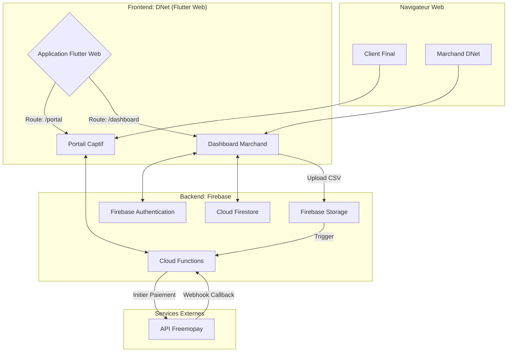

### **Architecture du Projet DNet**

#### **1. Vision d'Ensemble & Concept**

**DNet** est une solution SaaS (Software as a Service) qui se compose de deux interfaces principales, gérées par une seule application Flutter Web :

1.  **Le Dashboard Marchand :** Une interface web sécurisée où les propriétaires de hotspots (restaurants, hôtels, etc.) peuvent configurer leurs zones WiFi, créer des forfaits, importer et gérer des tickets d'accès.
2.  **Le Portail Captif Client :** Une page publique sur laquelle les clients finaux sont redirigés pour acheter un forfait WiFi via Freemopay et recevoir leurs identifiants de connexion.

L'architecture est conçue pour être **sécurisée**, **évolutive** et **maintenable**.

#### **2. Schéma d'Architecture de Haut Niveau**


*   **Les utilisateurs (Marchand, Client Final)** interagissent avec l'application Flutter Web via leur navigateur.
*   **L'application Flutter Web (DNet)** affiche le portail ou le dashboard en fonction de l'URL et du statut d'authentification.
*   **Le backend Firebase** gère toute la logique métier, les données et la sécurité.
*   **Les Cloud Functions** agissent comme une couche de serveur sécurisée pour communiquer avec l'API Freemopay et effectuer des opérations sensibles.

#### **3. Architecture Détaillée des Composants

##### **A. Frontend (Application Flutter Web)**

C'est la partie visible de l'iceberg, construite avec Flutter Web.

*   **Gestion de la Navigation (`go_router`)**
    *   `/` : Redirige vers `/portal` ou `/dashboard` selon la situation.
    *   `/portal/:zoneId` : Affiche le portail captif pour une zone WiFi spécifique.
    *   `/login` : Page de connexion pour les marchands.
    *   `/register` : Page d'inscription pour les marchands.
    *   `/dashboard` : Page d'accueil du marchand authentifié.
        *   `/dashboard/zones` : Gérer les zones WiFi.
        *   `/dashboard/zones/:zoneId/tickets` : Gérer les types de tickets pour une zone.
    *   `/retrieve-ticket` : Page pour récupérer un ticket acheté.

*   **Gestion de l'État (`getx`)**
    *   **Controllers :** Pour chaque fonctionnalité (ex: `AuthController`, `ZoneController`, `PaymentController`), séparant la logique de l'interface.
    *   **Services :** Pour injecter des dépendances comme le client Firestore ou le service d'API (`Get.put(FirestoreService())`).
    *   **Réactivité :** Utilisation de `Obx` ou `GetX` widgets pour mettre à jour l'interface automatiquement lorsque les données changent (ex: affichage du ticket après un paiement réussi).

*   **Modules Fonctionnels :**
    1.  **Module d'Authentification :** Gère les formulaires d'inscription et de connexion, la communication avec Firebase Auth.
    2.  **Module Dashboard Marchand :** Interface CRUD (Create, Read, Update, Delete) pour les zones, les types de tickets. Comprend un composant d'upload de fichiers CSV pour les tickets.
    3.  **Module Portail Captif :** Affiche les forfaits (lus depuis Firestore), gère le popup de paiement.
    4.  **Module de Paiement :** Contient la logique d'appel à la Cloud Function pour initier le paiement et l'écoute des changements de statut de la transaction dans Firestore.

##### **B. Backend (Firebase)**

C'est le cerveau de l'application.

*   **Cloud Firestore :**
    *   Utilisera la **structure de données détaillée précédemment**. Cette structure est optimisée pour les requêtes et les règles de sécurité.
    *   Les compteurs dénormalisés (`stats` dans `ticketTypes`) seront cruciaux pour les performances du dashboard.

*   **Firebase Authentication :**
    *   Gère les comptes marchands (email/mot de passe). L'UID généré est la clé pour lier toutes les données d'un marchand.

*   **Firebase Storage :**
    *   Utilisé pour stocker temporairement les fichiers CSV de tickets uploadés par les marchands avant qu'une Cloud Function ne les traite.

*   **Cloud Functions for Firebase (Node.js/TypeScript) - **Le Cœur de la Logique Métier****
    1.  `initiatePayment (Callable Function)`:
        *   **Déclencheur :** Appelée depuis l'app Flutter avec `zoneId`, `ticketTypeId`, `phoneNumber`.
        *   **Action :**
            1.  Vérifie que l'utilisateur n'est pas un bot (avec App Check si besoin).
            2.  Lit les `freemopayCredentials` du marchand depuis la sous-collection sécurisée.
            3.  Verrouille un ticket (`status: 'locked'`) dans Firestore.
            4.  Crée un document dans la collection `transactions` avec `status: 'pending'`.
            5.  Appelle l'API Freemopay (`POST /api/v2/payment`) avec les bonnes clés et l'ID de transaction comme `externalId`.
            6.  Retourne le statut de l'initialisation à l'app Flutter.
    2.  `freemopayWebhook (HTTP Function)`:
        *   **Déclencheur :** Requête POST de Freemopay sur l'URL de cette fonction.
        *   **Action :**
            1.  Valide l'authenticité de la requête (si Freemopay fournit un moyen de le faire, comme un secret partagé).
            2.  Récupère l'`externalId` du corps de la requête.
            3.  Met à jour la transaction dans Firestore (`status: 'success'` ou `'failed'`).
            4.  **Si succès :** met à jour le ticket correspondant (`status: 'sold'`) et les `stats` du `ticketType`.
            5.  **Si échec :** remet le ticket en `status: 'available'`.
            6.  Renvoie une réponse `200 OK` à Freemopay.
    3.  `processTicketUpload (Storage Trigger Function)`:
        *   **Déclencheur :** Lorsqu'un nouveau fichier CSV est finalisé dans un bucket Firebase Storage spécifique.
        *   **Action :**
            1.  Lit le fichier CSV.
            2.  Parse chaque ligne.
            3.  Crée un document pour chaque ticket dans la sous-collection Firestore appropriée (`.../tickets/{ticketId}`).
            4.  Met à jour le compteur `totalTicketsCount` et `availableTicketsCount` dans le document `ticketType`.
            5.  Supprime le fichier CSV une fois le traitement terminé.

*   **Règles de Sécurité (Firestore Security Rules) - CRUCIAL**
    *   Un marchand ne peut lire/écrire que dans son propre document (`allow read, write: if request.auth.uid == merchantId`).
    *   La sous-collection `freemopayCredentials` n'est accessible par **personne** depuis le client (`allow read, write: if false;`). Seules les Cloud Functions avec des droits d'admin peuvent y accéder.
    *   Les données du portail captif (noms des zones, types de tickets actifs) sont en lecture seule pour les utilisateurs non authentifiés.
    *   Les tickets ne peuvent être lus que lorsque la transaction associée est marquée comme "success" et que le demandeur prouve qu'il est l'acheteur (via un token ou son numéro de téléphone).

#### **4. Structure du Projet Flutter**

```
dnet_project/
└── lib/
    ├── app/
    │   ├── config/
    │   │   ├── theme.dart       // Thème de l'application (couleurs DNet, etc.)
    │   │   └── router.dart      // Configuration de GoRouter
    │   └── bindings/
    │       └── app_bindings.dart// Injections de dépendances globales (GetX)
    ├── data/
    │   ├── models/              // Modèles de données (user, zone, ticket, etc.)
    │   └── repositories/        // Logique de communication avec Firestore/API
    │       ├── auth_repository.dart
    │       └── merchant_repository.dart
    ├── features/                // Écrans et logique par fonctionnalité
    │   ├── auth/
    │   │   ├── controllers/
    │   │   └── views/           // login_screen.dart, register_screen.dart
    │   ├── dashboard/
    │   │   ├── controllers/
    │   │   └── views/           // dashboard_home.dart, zones_view.dart
    │   ├── captive_portal/
    │   │   ├── controllers/     // payment_controller.dart
    │   │   └── views/
    │   │       ├── portal_view.dart
    │   │       └── widgets/     // ticket_card.dart, payment_popup.dart
    │   └── ticket_retrieval/
    │       ├── controllers/
    │       └── views/
    ├── shared/
    │   ├── widgets/             // Widgets réutilisables (boutons, champs de texte)
    │   ├── constants/           // Constantes (couleurs, textes)
    │   └── utils/               // Fonctions utilitaires
    └── main.dart                // Point d'entrée de l'application
```